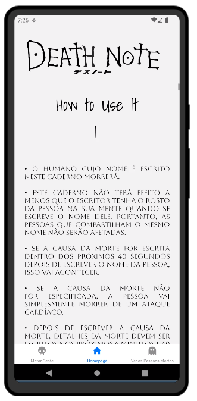
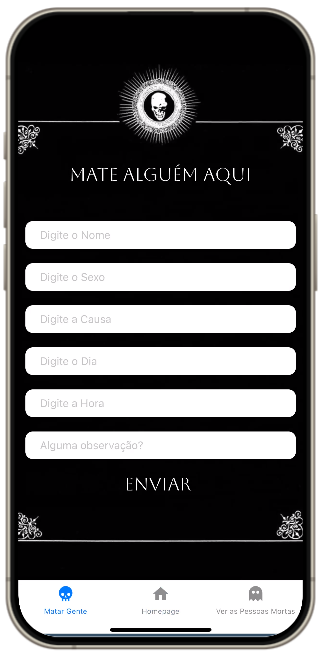
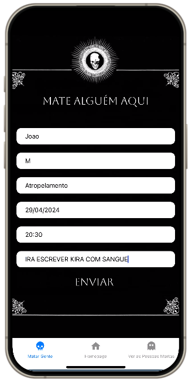
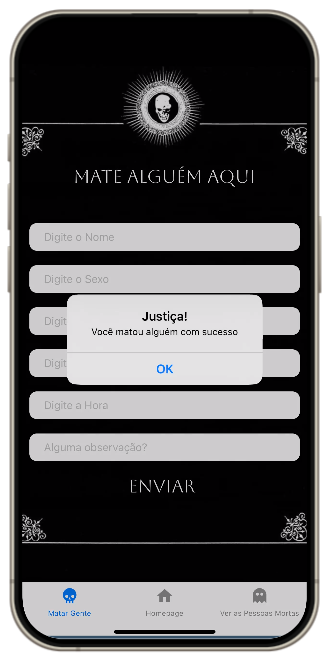
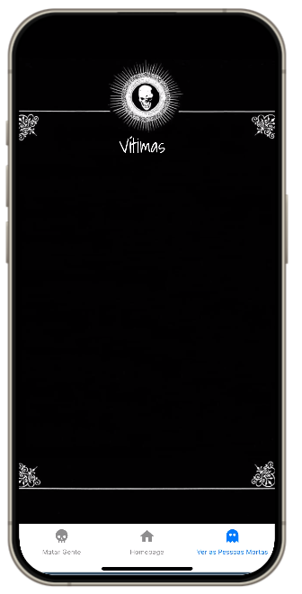
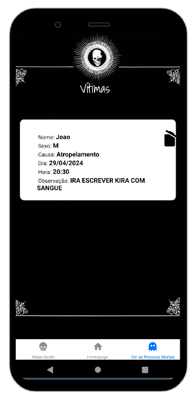
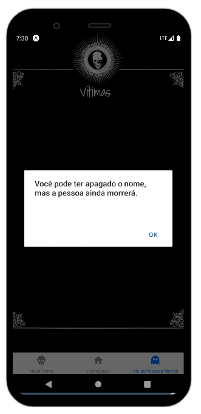

# appDeathNote
Projeto de aplicativo para usar CRUD com firebase.

  <h3>Tela inicial com as regras do Death Note</h3>
  

  

  <h3>Tela do Cadastro ou Tela para matar gente com o Death Note e como fica depois do cadastro</h3>
  

  

  <h3>Tela onde mostra os cadastrados. Mesmo deletando, é impossível para o Death Note</h3>
  

